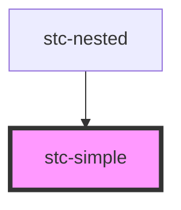

# my-component

<!-- Auto Generated Below -->

## Dependencies

### Used by

 - [stc-nested](../my-nested)

### Graph

----------------------------------------------

*Built with [StencilJS](https://stenciljs.com/)*
