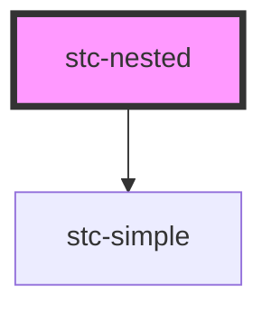

# my-nested

<!-- Auto Generated Below -->

## Dependencies

### Depends on

- [stc-simple](../my-component)

### Graph

----------------------------------------------

*Built with [StencilJS](https://stenciljs.com/)*
